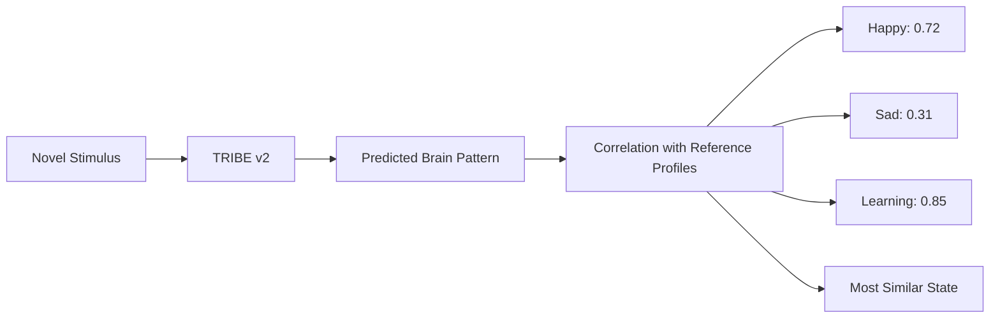

# Making Sense of TRIBE v2: Mapping Brain Predictions to Emotions & Cognition

## What Does TRIBE v2 Actually Produce?

TRIBE v2 is a **brain encoding model** — it takes stimuli (video, audio, text) and predicts what the **fMRI response** would look like across the cortical surface. Specifically:

- **Output shape**: `(n_timesteps, 20484)` — one prediction per second (1 TR), across ~20k cortical vertices
- **Surface template**: `fsaverage5` — a standard FreeSurfer cortical mesh with 10,242 vertices per hemisphere (left + right = 20,484)
- **What each value means**: Predicted BOLD signal (blood-oxygen-level-dependent), the same signal measured by real fMRI scanners
- **What it models**: The "average subject" brain response — trained on 720+ subjects, 1000+ hours of fMRI

> [!IMPORTANT]
> TRIBE v2 is an **encoding** model (stimulus → brain activity), **not** a **decoding** model (brain activity → label). It predicts what the brain *would do*, not what emotion a person *feels*. To get emotional/cognitive labels, you need an additional interpretation layer on top.

---

## Three Strategies to Extract Emotional/Cognitive Meaning

### Strategy 1: ROI-Based Analysis (Best Starting Point)
**Idea**: Map the ~20k vertices to known brain regions, then interpret activation in those regions using established neuroscience.

#### How It Works

The fsaverage5 surface can be parcellated using standard cortical atlases:

| Atlas | Regions | Best For |
|-------|---------|----------|
| **Desikan-Killiany** | 34 regions/hemisphere | Broad functional areas |
| **Destrieux** | 74 regions/hemisphere | Fine-grained sulcal/gyral anatomy |
| **HCP-MMP (Glasser)** | 180 regions/hemisphere | State-of-the-art functional parcellation |

```python
# Conceptual code
from nilearn import datasets

# Get atlas labels for every vertex on fsaverage5
destrieux = datasets.fetch_atlas_surf_destrieux()
# destrieux['map_left'] → array of shape (10242,) with integer labels
# destrieux['labels'] → list of region names

# For each prediction timestep, compute mean activation per region
for region_id, region_name in enumerate(destrieux['labels']):
    mask = (destrieux['map_left'] == region_id)
    region_activation = preds[:, :10242][:, mask].mean(axis=1)
    # → time series of activation for this region
```

#### Key Cortical Regions for Emotions & Learning

| Brain State | Key **Cortical** Regions (on fsaverage5) | What High Activation Suggests |
|-------------|------------------------------------------|-------------------------------|
| **Happy / Positive** | Ventromedial PFC (vmPFC), Orbitofrontal cortex | Reward processing, positive valence |
| **Sad / Negative** | Anterior insula, Anterior cingulate cortex (ACC), Temporal pole | Negative affect, interoception, social pain |
| **Attending / Engaged** | Intraparietal sulcus, Frontal eye fields (DAN) | Top-down directed attention |
| **Curiosity / Learning** | ACC, vmPFC, Dorsolateral PFC | Uncertainty resolution, executive function |
| **Language Processing** | Superior temporal sulcus, Broca's area | Speech comprehension, production |
| **Visual Processing** | Occipital cortex, Fusiform gyrus | Visual scene/face processing |

> [!WARNING]
> **Critical limitation**: Many emotion-relevant structures are **subcortical** (amygdala, hippocampus, nucleus accumbens, VTA). These are **NOT** on the cortical surface and are **NOT** in fsaverage5. TRIBE v2's cortical predictions cannot directly capture their activity. You can only measure cortical *correlates* of emotional processing.

#### Practical Implementation

```python
# Pseudo-code for ROI emotion scoring
import numpy as np

def compute_region_scores(preds, atlas_map_left, atlas_map_right, atlas_labels):
    """Extract mean activation per brain region per timestep."""
    n_verts = preds.shape[1] // 2
    results = {}
    for region_id, name in enumerate(atlas_labels):
        left_mask = (atlas_map_left == region_id)
        right_mask = (atlas_map_right == region_id)
        left_act = preds[:, :n_verts][:, left_mask].mean(axis=1) if left_mask.sum() > 0 else 0
        right_act = preds[:, n_verts:][:, right_mask].mean(axis=1) if right_mask.sum() > 0 else 0
        results[name] = (left_act + right_act) / 2
    return results

# Then define composite scores:
def emotion_valence_score(region_scores):
    """Positive = happy/reward, Negative = sad/distress."""
    positive = region_scores['G_and_S_cingul-Ant']  # ACC
    negative = region_scores['S_circular_insula_ant']  # anterior insula
    return positive - negative  # Crude valence estimate
```

---

### Strategy 2: Comparison-Based Differential Analysis (Most Powerful)
**Idea**: Run TRIBE v2 on stimuli with known emotional content, then compare the predicted brain patterns.

#### The Approach

```
┌──────────────┐     ┌─────────┐     ┌────────────────────┐
│ "Happy" text │────▶│ TRIBE   │────▶│ pred_happy (T, 20k)│
│ or audio/vid │     │ v2      │     │                    │
└──────────────┘     └─────────┘     └────────────────────┘

┌──────────────┐     ┌─────────┐     ┌────────────────────┐
│ "Sad" text   │────▶│ TRIBE   │────▶│ pred_sad (T, 20k)  │
│ or audio/vid │     │ v2      │     │                    │
└──────────────┘     └─────────┘     └────────────────────┘

                 diff = pred_happy - pred_sad
                 → Vertices that distinguish happy from sad
```

#### Why This Is Powerful

- TRIBE v2's whole value is as an **in-silico experiment platform** — this is exactly how Meta intends it to be used
- You can run thousands of stimuli in seconds (vs. hours in a real scanner)
- The differential pattern automatically reveals **which brain regions** respond differently to different emotional content
- No need for external labels — the emotional content of the stimulus IS the label

#### Example Experiment

```python
# 1. Create stimulus sets
happy_texts = [
    "I just won the lottery! My family is celebrating with me.",
    "The sun is shining and the birds are singing beautifully.",
    "I received a promotion and everyone congratulated me warmly.",
]

sad_texts = [
    "I lost my best friend today. The world feels empty.",
    "The rain won't stop and I feel so alone in this room.",
    "Nobody came to my birthday party. I sat there by myself.",
]

# 2. Run predictions for each
happy_preds = []
for text in happy_texts:
    df = model.get_events_dataframe(text_path=save_text(text))
    preds, _ = model.predict(events=df)
    happy_preds.append(preds.mean(axis=0))  # Average across time

sad_preds = []
for text in sad_texts:
    df = model.get_events_dataframe(text_path=save_text(text))
    preds, _ = model.predict(events=df)
    sad_preds.append(preds.mean(axis=0))

# 3. Compute differential maps
mean_happy = np.stack(happy_preds).mean(axis=0)  # (20484,)
mean_sad = np.stack(sad_preds).mean(axis=0)       # (20484,)
diff_map = mean_happy - mean_sad                  # Where they differ

# 4. Visualize on brain surface
plotter.plot_brain(diff_map, cmap="RdBu_r", title="Happy vs Sad")
```

#### Building a Reference Library
You can systematically build a library of "brain signatures" for different states:

| Category | Stimuli to Use |
|----------|---------------|
| **Happy** | Joyful music, comedy clips, uplifting narratives |
| **Sad** | Melancholic music, tragic film scenes, grief narratives |
| **Fearful** | Horror clips, threatening scenarios |
| **Calm/Relaxed** | Nature sounds, meditation guides |
| **Focused/Learning** | Lecture clips, puzzle-solving narratives |
| **Bored/Disengaged** | Monotone speech, repetitive content |
| **Curious** | Mystery narratives, "did you know" content |

---

### Strategy 3: Reference Profile Pattern Matching (Most Scalable)
**Idea**: Given a novel stimulus, predict its brain pattern, then compare to pre-computed reference profiles to classify the "brain state."



#### Implementation

```python
from scipy.spatial.distance import cosine

class BrainStateClassifier:
    def __init__(self):
        self.reference_profiles = {}
    
    def add_reference(self, state_name, brain_pattern):
        """Store a reference brain pattern for a named state."""
        self.reference_profiles[state_name] = brain_pattern
    
    def classify(self, brain_pattern, top_k=3):
        """Compare a brain pattern to all references."""
        scores = {}
        for name, ref in self.reference_profiles.items():
            # Pearson correlation across all vertices
            scores[name] = np.corrcoef(brain_pattern, ref)[0, 1]
        return sorted(scores.items(), key=lambda x: -x[1])[:top_k]
```

---

## What About "Conducive to Learning"?

This is the most nuanced question. Neuroscience identifies several **cortical markers** of learning-readiness:

### Cortical Indicators (Measurable by TRIBE v2)

1. **Prefrontal Engagement**: High activity in dorsolateral PFC → executive attention, working memory
2. **Temporal Lobe Activity**: Superior temporal regions → language comprehension, auditory processing
3. **ACC Activation**: Anterior cingulate → conflict monitoring, uncertainty detection, curiosity
4. **Low Visual Cortex Dominance**: If most activity is in occipital/visual areas with low frontal activity → passive viewing, not deep processing
5. **Distributed vs. Localized Patterns**: Learning engages widespread networks; passive consumption is more localized

### A "Learning Score" Heuristic

```python
def learning_readiness_score(preds, atlas):
    """
    Higher score = brain pattern more consistent with active learning.
    Based on: high PFC + ACC + temporal engagement,
              relative to passive visual processing.
    """
    pfc = mean_activation(preds, atlas, regions=['superiorfrontal', 
                                                   'rostralmiddlefrontal',
                                                   'caudalmiddlefrontal'])
    acc = mean_activation(preds, atlas, regions=['caudalanteriorcingulate',
                                                   'rostralanteriorcingulate'])
    temporal = mean_activation(preds, atlas, regions=['superiortemporal',
                                                       'middletemporal'])
    visual = mean_activation(preds, atlas, regions=['lateraloccipital',
                                                      'cuneus', 'pericalcarine'])
    
    # Active learning: high frontal + temporal, relative to visual
    engagement = (pfc + acc + temporal) / 3
    score = engagement / (visual + 1e-8)  # Ratio of "thinking" vs "watching"
    return score
```

> [!NOTE]
> This is a **heuristic**. Real learning involves subcortical structures (hippocampus for memory, VTA for dopamine/motivation) that are not on the cortical surface. The cortical pattern gives useful but incomplete information.

---

## Recommended Approach: A Practical Roadmap

### Phase 1: Build Reference Profiles (Week 1)
1. Curate stimulus sets: 5-10 text passages per emotional/cognitive category
2. Run each through TRIBE v2 to get predicted brain patterns
3. Average within each category to create reference profiles
4. Visualize differential maps on brain surface

### Phase 2: ROI Analysis Infrastructure (Week 1-2)
1. Integrate Destrieux or Desikan-Killiany atlas with TRIBE v2 outputs
2. Build ROI extraction pipeline (vertex → region → activation time series)
3. Create composite scores for emotion categories

### Phase 3: Build Classifier Tool (Week 2-3)
1. Given a novel stimulus, run TRIBE v2 prediction
2. Compare to reference profiles using correlation
3. Extract ROI-based scores for interpretability
4. Output: ranked emotional/cognitive labels with confidence scores

### Phase 4: Visualization Dashboard (Week 3-4)
1. Brain surface heatmap showing activation
2. ROI bar chart showing region-level activation
3. Emotion radar chart showing similarity to reference profiles
4. Time-series view showing how states evolve during a stimulus

---

## Important Caveats

> [!CAUTION]
> **This is NOT clinical**. TRIBE v2 predicts what an *average* brain would do, not a specific individual's brain. Do not use this for clinical diagnosis, therapy decisions, or any medical purpose.

> [!WARNING]
> **Subcortical blind spot**: The most emotion-critical structures (amygdala, hippocampus, basal ganglia) are subcortical and NOT represented in fsaverage5 cortical predictions. Emotional classification from cortical-only data will always be approximate.

> [!NOTE]
> **Encoding ≠ Decoding**: TRIBE v2 tells you "if someone experienced this stimulus, their brain would look like X." It does NOT tell you "this brain pattern means the person is happy." The correlation between stimuli and emotions is the bridge you're building.

### What Makes This Still Valuable

Despite these caveats, the approach is genuinely useful because:
1. **Cortical correlates exist**: Even though emotions originate subcortically, cortical regions (PFC, ACC, insula, temporal pole) show reliable emotion-related patterns
2. **Comparison is powerful**: The A/B comparison approach (same model, different stimuli) naturally cancels out model biases
3. **Scale**: You can run thousands of virtual experiments in minutes
4. **The model is state-of-the-art**: Trained on 720+ subjects, it captures robust, generalizable brain response patterns
5. **Published validation**: Meta demonstrated that TRIBE v2 recovers established neuroscience results from decades of research

---

## Summary of Recommendations

| Approach | Difficulty | Value | Best For |
|----------|-----------|-------|----------|
| **ROI Analysis** | ⭐⭐ Medium | ⭐⭐⭐ High | Answering "which brain regions respond?" |
| **Differential Comparison** | ⭐ Easy | ⭐⭐⭐⭐ Very High | "How does happy differ from sad in the brain?" |
| **Pattern Matching Classifier** | ⭐⭐⭐ Hard | ⭐⭐⭐⭐⭐ Highest | "Is this stimulus more happy or sad?" |
| **Learning Score Heuristic** | ⭐⭐ Medium | ⭐⭐⭐ High | "Is this content engaging the learning brain?" |

> [!TIP]
> **Start with Strategy 2** (Differential Comparison). It's the most immediately useful, requires minimal external dependencies, and is exactly how Meta intended the model to be used. Build a library of "happy text", "sad text", "educational text", and compare their predicted brain patterns. The differences tell you exactly which brain regions and networks distinguish these states.
